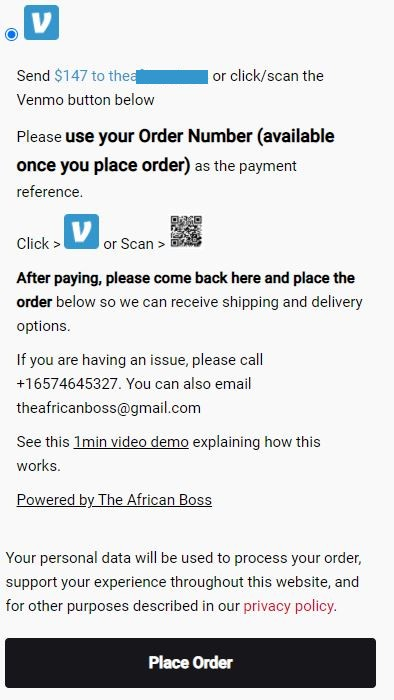
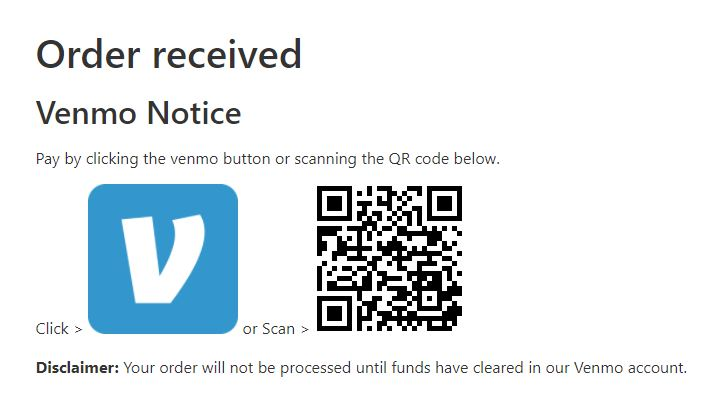
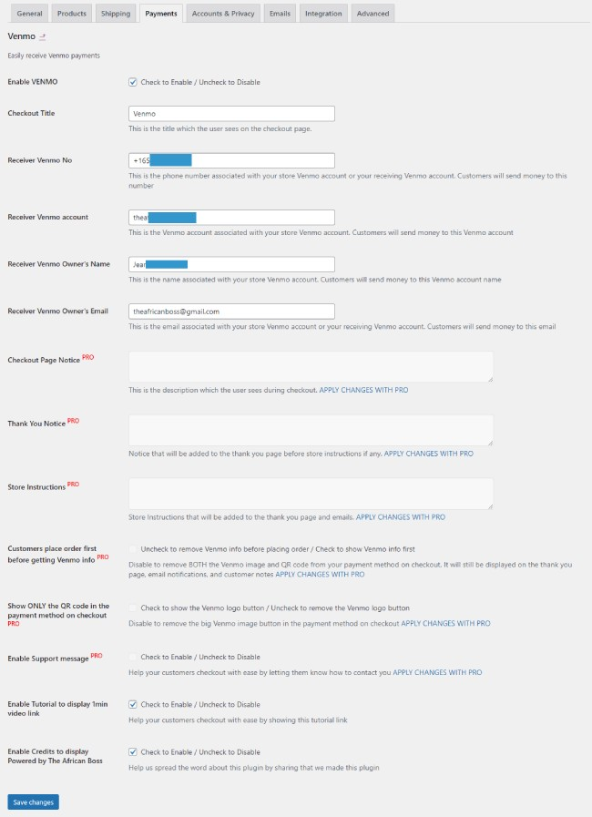

  

  <h3 align="center">Checkout with Venmo - Checkout on Woocommerce with Venmo</h3>

  

    The top finance app in the App Store now available on WordPress. Receive Venmo payments on your website with WooCommerce + Venmo
    Venmo is the fast, safe, social way to pay and get paid. 
    Join more than 65 million people who use the Venmo app today.
    Pay and get paid for anything from your share of rent to a birthday gift. Add a note to each payment to connect with friends and remember the moments, not the money.
     
    <a href="https://theafricanboss.com/venmo"><strong>Learn More »</strong></a>
     
     
    <a href="https://theafricanboss.com/venmo">View Demo</a>
    ·
    <a href="https://github.com/theafricanboss/woocommerce-venmo/issues">Report Bug</a>
    ·
    <a href="https://github.com/theafricanboss/woocommerce-venmo/issues">Request Feature</a>
  

## PRO or customized version

Please reach out to theafricanboss@gmail.com for a custom version of this plugin.

Visit [The African Boss](https://theafricanboss.com/venmo) for more details

## Demo

An example of the plugin in use is the following store:

[Gura Stores](https://gurastores.com/)

This plugin displays a Venmo link or a QR code

See the screenshots or the store example of [Gura Stores](https://gurastores.com/) for visual details.

## Screenshots

- This is what the customer visiting your website will see at the checkout page

- This is what the customer visiting your website will see on the thank you page after placing the order

- This is what you will submit when setting up the plugin and this information will be displayed to your customers

## Installation

### From Dashboard ( WordPress admin )

- Go to Plugins -> Add New
- Search for ‘Checkout with Venmo’
- Click on Install Now
- Activate the plugin through the “Plugins” menu in WordPress.

### Using cPanel or FTP

- Download ‘Checkout with Venmo’ from [The African Boss](https://theafricanboss.com/venmo)
- Unzip wc-venmo.zip file and
- Upload wc-venmo folder to the “/wp-content/plugins/” directory.
- Activate the plugin through the “Plugins” menu in WordPress.

### After Plugin Activation

Find and click Venmo in your admin dashboard left sidebar to access Venmo settings

**or**

Go to Woocommerce-> Settings-> Payments screen to configure the plugin

Also _you can visit_ the [plugin page](https://theafricanboss.com/venmo) for further setup instructions.

## Frequently Asked Questions

### Does Venmo integrate Payment APIs?

Venmo plugin is a quick and easy way to display to your customers your CashTag and to link them to it.
Unfortunately, this plugin doesn't integrate a full Venmo end-to-end payment. It only displays your cashtag to the customer and redirects them to it so that the off site Venmo transaction can take place.

Please check screenshots for more details on what is reported.
